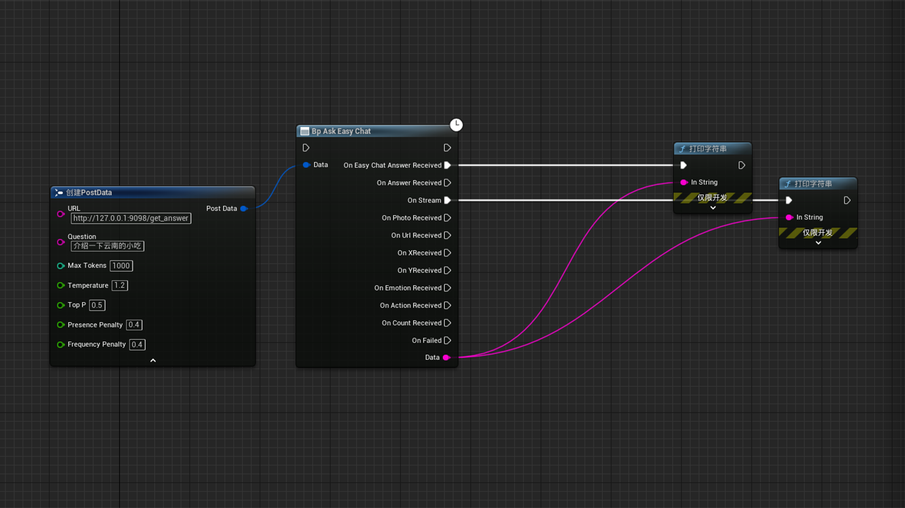

<p align="center">
    
</p>

<h1 align="center">EasyChat Q&A System</h1>

<div align="center">

EasyChat is designed to manage and serve question-answer pairs with ease using FastAPI, SQLAlchemy, and various other Python libraries. It supports functionalities such as CRUD operations on Q&A pairs, photo management, license verification, and fuzzy matching for question-answer retrieval. Additionally, it integrates with the RWKV server for model-based Q&A and logs statistics for user interactions.

[![license][license-image]][license-url]
[![py-version][py-version-image]][py-version-url]

[English](README.md)

</div>

## Features

- **Database Operations**: Manage Q&A pairs with CRUD operations.
- **Q&A Management**: Add, delete, clear, and retrieve Q&A pairs with fuzzy matching for better question-answer retrieval.
- **License Verification**: Ensure authorized use with cryptographic methods and time tampering detection.
- **API Endpoints**: FastAPI endpoints for managing Q&A pairs, photos, and settings.
- **RWKV Server Management**: Manage the lifecycle of the RWKV server process for model-based Q&A.
- **Statistics Logging**: Track interactions, errors, and unlogged questions.
- **Character Counting**: Utility functions for counting and filtering Chinese characters, English letters, and numbers in text.

### Steps

1. Directly double-click to open `server.exe` to run the server and open the webpage at [http://127.0.0.1:9098/](http://127.0.0.1:9098/).
2. Click the register button, copy the machine code, and provide it to the administrator to receive a license key.
3. Enter the license key on the webpage [http://127.0.0.1:9098/](http://127.0.0.1:9098/) to start using the system normally.

## Usage

### API Endpoints

- **Add Q&A Pair**: 
  ```sh
  POST /add_qa/
  ```
- **Get Q&A Data**: 
  ```sh
  GET /qa_data/
  ```
- **Update Q&A Pair**: 
  ```sh
  PUT /update_qa/{id}
  ```
- **Delete Q&A Pair**: 
  ```sh
  DELETE /delete_qa/{id}
  ```
- **Clear All Q&A Pairs**: 
  ```sh
  POST /clear_qa/
  ```
- **Upload Photos**: 
  ```sh
  POST /upload_photos/
  ```
- **Clear All Photos**: 
  ```sh
  DELETE /clear_photos/
  ```
- **Verify License**: 
  ```sh
  POST /verify_license
  ```
- **Get UUID**: 
  ```sh
  GET /get_uuid
  ```
- **Reset License**: 
  ```sh
  POST /reset_license
  ```
- **Upload File**: 
  ```sh
  POST /upload_file/
  ```
- **Export Q&A Pairs**: 
  ```sh
  GET /export_qa_pairs/
  ```
- **Start RWKV Server**: 
  ```sh
  POST /start_rwkv_server
  ```
- **Stop RWKV Server**: 
  ```sh
  POST /stop_rwkv_server
  ```
- **Get Settings**: 
  ```sh
  GET /settings
  ```
- **Modify Settings**: 
  ```sh
  POST /settings_modify
  ```
- **Get Stats**: 
  ```sh
  GET /stats
  ```
- **Get Unlogged Questions**: 
  ```sh
  GET /unlogged_questions
  ```
- **Clear Unlogged Questions**: 
  ```sh
  POST /clear_unlogged_questions
  ```

## Unreal Engine Integration

### Interaction with Unreal Engine Plugin

EasyChat can be integrated with Unreal Engine using the provided plugin to enable interaction within Unreal Engine projects.

#### Installation Steps

1. **Download the Plugin**:
   Download the EasyChat Unreal Engine plugin from the repository or release page.

2. **Add to Your Project**:
   Copy the plugin folder to the `Plugins` directory of your Unreal Engine project.

3. **Enable the Plugin**:
   Open your Unreal Engine project, go to `Edit` -> `Plugins`, and enable the EasyChat plugin.

4. **Configure the Plugin**:
   In the Unreal Engine project settings, search for the `BP Ask Easy Chat` blueprint module, at Data, use the mouse to drag out the operation panel that provides the `Post Data` structure, select the `Create PostData` option, and configure the EasyChat plugin by setting the API endpoint to `http://127.0.0.1:9098/get_answer`.



#### Using the Plugin

- **Send Questions**:
  Use the `Question` option of the provided `Create PostData` blueprint module to send questions to EasyChat and receive the returned answers in your Unreal Engine project.

- **Processing Response**:
  Select the answer you need to get in the `BP Ask Easy Chat` blueprint module, which can automatically parse and output only the required data string.

  - `OnEasyChatAnswerReceived`: Output is the preset answer, and only supports the output of the whole sentence.
  - `OnAnswerReceived`: Output is the answer of the RWKV language model, and only supports the output of the whole sentence.
  - `OnStream`: Output is the answer of the RWKV language model, and only supports the output of HTTP streaming.
  - `OnPhotoReceived`: Output is the URL address of the picture provided in the preset answer.
  - `OnUrlReceived`: Output is the URL address provided in the preset answer.
  - `OnXReceived`, `OnYReceived`: Output is the size of the picture provided in the preset answer.
  - `OnEmotionReceived`: Output is the emotion text provided in the preset answer.
  - `OnActionReceived`: Output is the action text provided in the preset answer.
  - `OnCountReceived`: Output is the number of characters in the answer.

For more detailed instructions and examples, refer to the plugin documentation included in the plugin folder.

## Screenshots

### EasyChat Frontend - Chat Interface


### EasyChat Frontend - Data Management


### EasyChat Frontend - Q&A Management


## License

This project is licensed under the terms of the MIT license. See `LICENSE` for more details.

## Contact

For any inquiries or issues, please contact the project maintainers at [contact@example.com](gakkiopl@qq.com).

---

[license-image]: http://img.shields.io/badge/license-MIT-blue.svg
[license-url]: ./LICENSE
[py-version-image]: https://img.shields.io/pypi/pyversions/fastapi.svg
[py-version-url]: https://pypi.org/project/fastapi/

---
